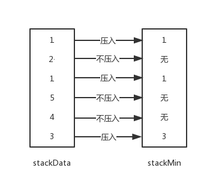

## 设计一个有getMin功能的栈

### 【题目】
实现一个特殊的栈，在实现栈的基本功能的基础上，再实现返回栈中最小元素的操作
### 【要求】
1. pop,push,getMin操作的时间复杂度都是O(1);
2. 设计的栈类型可以使用现成的栈结构。
### 【解答】
设计两个栈(JavaScript中用数组来模拟)，一个栈（stackData）用于保存当前数据，没有特殊功能；另一个栈(stackMin)的栈顶始终记录每次操作结束后，当前栈内的最小值。

#### 1. push操作
push操作针对两个栈，stackData栈正常压入数据，stackMin栈需要比较栈顶和当前要压入数据的大小，比栈顶小就压入，否则不压入；下图展示了依次压入3，4，5，1，2，1，两个栈的变化情况：

#### 2. pop操作

从stackData中正常弹出数据，弹出的数据需要与stackMin栈顶元素进行比较，如果比栈顶元素大，stackMin不弹出元素，否则弹出栈顶；

#### 3. getMin操作
直接获取stackMin的栈顶元素
